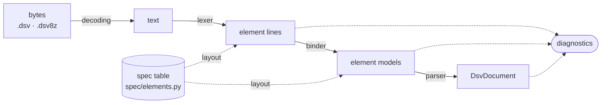

# DSV Parser

Parser for DSV swim-meet files (`.dsv5` through `.dsv8`, including `.dsv8z`) into a typed data schema. Usable as a Python library, as a CLI, and as a FastAPI service whose OpenAPI document exposes the same schema to services in other languages.

Format **6**, **7** and **8** are covered in full, transcribed from the official specifications of the Deutscher Schwimm-Verband.

---

## Tech Stack

[![Python][Python.com]][Python-url]
[![Pydantic][Pydantic]][Pydantic-url]
[![FastAPI][FastAPI]][FastAPI-url]
[![Uvicorn][Uvicorn]][Uvicorn-url]
[![OpenAPI][OpenAPI]][OpenAPI-url]
[![uv][UV]][UV-url]
[![Hatch][Hatch]][Hatch-url]
[![Ruff][Ruff]][Ruff-url]
[![mypy][Mypy]][Mypy-url]
[![pytest][Pytest]][Pytest-url]
[![pytest-cov][PytestCov]][PytestCov-url]
[![pip-audit][PipAudit]][PipAudit-url]
[![pre-commit][PreCommit]][PreCommit-url]
[![GNU Make][Make]][Make-url]
[![Docker][Docker]][Docker-url]
[![GitHub Actions][Actions]][Actions-url]

---

## Format Coverage

| Format | Valid                   | State                                            |
| ------ | ----------------------- | ------------------------------------------------ |
| **8**  | from 01.08.2026         | Complete, specification of 14.03.2026            |
| **7**  | 01.01.2023 – 31.12.2026 | Complete, specification of 31.08.2022            |
| **6**  | 01.09.2015 – 31.07.2023 | Complete, specification of 01.11.2015            |
| **5**  | until 31.12.2015        | Derived from the Format 6 change log             |

All four types (Wettkampfdefinitions-, Vereinsmelde-, Vereinsergebnis- and Wettkampfergebnisliste) with every element and attribute. The packed `.dsv8z` variant is unwrapped transparently.

Checked against nine real EasyWk files in Format 6 and 7, about 26 000 elements, with no errors or warnings. Details in the [format reference](docs/dsv-format.md).

---

## Quick Start

### Prerequisites

| Tool                 | Version | Needed for                                     |
| -------------------- | ------- | ---------------------------------------------- |
| **uv**               | —       | dependencies, every `make` target              |
| **Python**           | 3.12    | fetched by uv from `.python-version`           |
| **Docker** + Compose | —       | `make up`, `make image`                        |
| **pre-commit**       | —       | the formatting hook before a commit (optional) |

### Install

As a dependency of another project:

```bash
pip install dsv-parser            # library + CLI
pip install "dsv-parser[api]"     # plus the FastAPI service
uv add dsv-parser
```

Every GitHub Release is published to PyPI automatically, so the version there tracks the tags in this repository.

To work on the parser itself:

```bash
make install     # uv sync --extra api
```

The `api` extra adds FastAPI and uvicorn. The parser itself needs only Pydantic, so a library-only consumer can leave the extra out.

### Run

```bash
make dev         # CLI help with every subcommand
make spec        # the element table as implemented
make serve       # FastAPI on :8000 with reload
make up          # the same in Docker
make ps          # container status and health
make logs        # follow the logs
make down        # stop and remove
```

### Use it

```python
from dsv_parser import parse_file

result = parse_file("2026-06-13-Berlin-Pr.DSV8")

print(result.document.meet.name, result.document.file_type)
for swim in result.document.individual_results:
    print(swim.place, swim.name, swim.time_millis)

for entry in result.diagnostics.entries:
    print(entry.render())
```

```bash
dsv-parser parse meet.DSV8 -o meet.json       # document as JSON
dsv-parser parse meet.DSV8 --summary          # header and element counts only
dsv-parser check meet.DSV8                    # validate, exit 1 on data loss
dsv-parser spec --json                        # element table as data
```

---

## HTTP Surface

| Method | Path            | Purpose                                        |
| ------ | --------------- | ---------------------------------------------- |
| `POST` | `/parse`        | Parse a file and return the document           |
| `POST` | `/check`        | Validate a file without returning the document |
| `GET`  | `/spec`         | Element table and all code lists               |
| `GET`  | `/health`       | Liveness and the supported format versions     |
| `GET`  | `/openapi.json` | The schema, for generated clients              |

```bash
curl -F file=@meet.DSV8 http://localhost:8000/parse
curl -F file=@meet.DSV8 http://localhost:8000/check
```

A readable upload always returns **200**. Content problems come back as diagnostics rather than HTTP errors, since a partially readable file is a normal result. Check `clean` and `diagnostics`, not the status code.

The document schema in `/openapi.json` is the same Pydantic model the library returns. See the [HTTP API](docs/api.md).

---

## Configuration

| Variable    | Default | Effect    |
| ----------- | ------- | --------- |
| `LOG_LEVEL` | `INFO`  | Log level |

There is nothing else. The service holds no state and can be mounted into another app with `app.include_router(dsv_parser.api.router)`.

---

## Design

The attribute layouts live as data in [`dsv_parser/spec/elements.py`](dsv_parser/spec/elements.py), one entry per element, with `versions=` and `file_types=` wherever the four format versions or the four list kinds differ. For example, `WETTKAMPF` has no best-list attribute in a Vereinsmeldeliste, which moves the two qualification attributes one position forward. In the table that is a single `file_types=` on one attribute.



More in the [architecture notes](docs/architecture.md).

---

## Common Commands

```bash
make help                     # every target
make test                     # unit tests, offline, no coverage gate
make test-it                  # full run incl. integration and coverage
make lint                     # ruff check
make format                   # ruff: import order and formatting
make format-check             # the same, read-only
make typecheck                # mypy
make audit                    # pip-audit
make image                    # build the runtime image
make clean                    # remove caches and the venv
```

---

## Further Reading

- [Architecture](docs/architecture.md) — pipeline, element table, decisions
- [Format reference](docs/dsv-format.md) — the format and the version differences
- [Data schema](docs/data-schema.md) — how the document is laid out
- [HTTP API](docs/api.md) — endpoints, payloads, client generation
- [CLI](docs/cli.md) — subcommands, flags, exit codes
- [Extending](docs/extending.md) — adding elements, versions and code lists

## License

[MIT](LICENSE) — use it, change it, ship it, commercially or not.

<!-- MARKDOWN LINKS -->

[Python.com]: https://img.shields.io/badge/Python%203.12-3776AB?style=for-the-badge&logo=python&logoColor=white
[Python-url]: https://www.python.org
[Pydantic]: https://img.shields.io/badge/Pydantic-E92063?style=for-the-badge&logo=pydantic&logoColor=white
[Pydantic-url]: https://docs.pydantic.dev
[FastAPI]: https://img.shields.io/badge/FastAPI-009688?style=for-the-badge&logo=fastapi&logoColor=white
[FastAPI-url]: https://fastapi.tiangolo.com
[Uvicorn]: https://img.shields.io/badge/Uvicorn-499848?style=for-the-badge&logoColor=white
[Uvicorn-url]: https://www.uvicorn.org
[OpenAPI]: https://img.shields.io/badge/OpenAPI-6BA539?style=for-the-badge&logo=openapiinitiative&logoColor=white
[OpenAPI-url]: https://www.openapis.org
[UV]: https://img.shields.io/badge/uv-DE5FE9?style=for-the-badge&logo=astral&logoColor=white
[UV-url]: https://docs.astral.sh/uv/
[Hatch]: https://img.shields.io/badge/Hatchling-4051B5?style=for-the-badge&logo=python&logoColor=white
[Hatch-url]: https://hatch.pypa.io
[Ruff]: https://img.shields.io/badge/Ruff-D7FF64?style=for-the-badge&logo=ruff&logoColor=black
[Ruff-url]: https://docs.astral.sh/ruff/
[Mypy]: https://img.shields.io/badge/mypy-1F5082?style=for-the-badge&logo=python&logoColor=white
[Mypy-url]: https://mypy-lang.org
[Pytest]: https://img.shields.io/badge/pytest-0A9EDC?style=for-the-badge&logo=pytest&logoColor=white
[Pytest-url]: https://docs.pytest.org
[PytestCov]: https://img.shields.io/badge/pytest--cov-0A9EDC?style=for-the-badge&logoColor=white
[PytestCov-url]: https://pytest-cov.readthedocs.io
[PipAudit]: https://img.shields.io/badge/pip--audit-2C5BB4?style=for-the-badge&logo=python&logoColor=white
[PipAudit-url]: https://pypi.org/project/pip-audit/
[PreCommit]: https://img.shields.io/badge/pre--commit-FAB040?style=for-the-badge&logo=precommit&logoColor=black
[PreCommit-url]: https://pre-commit.com
[Make]: https://img.shields.io/badge/GNU%20Make-A42E2B?style=for-the-badge&logo=gnu&logoColor=white
[Make-url]: https://www.gnu.org/software/make/
[Docker]: https://img.shields.io/badge/Docker-2496ED?style=for-the-badge&logo=docker&logoColor=white
[Docker-url]: https://www.docker.com
[Actions]: https://img.shields.io/badge/GitHub%20Actions-2088FF?style=for-the-badge&logo=githubactions&logoColor=white
[Actions-url]: https://github.com/features/actions
