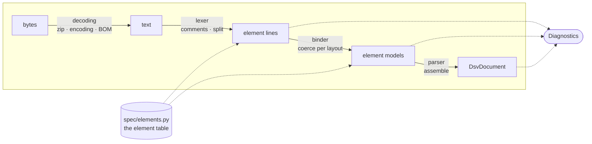
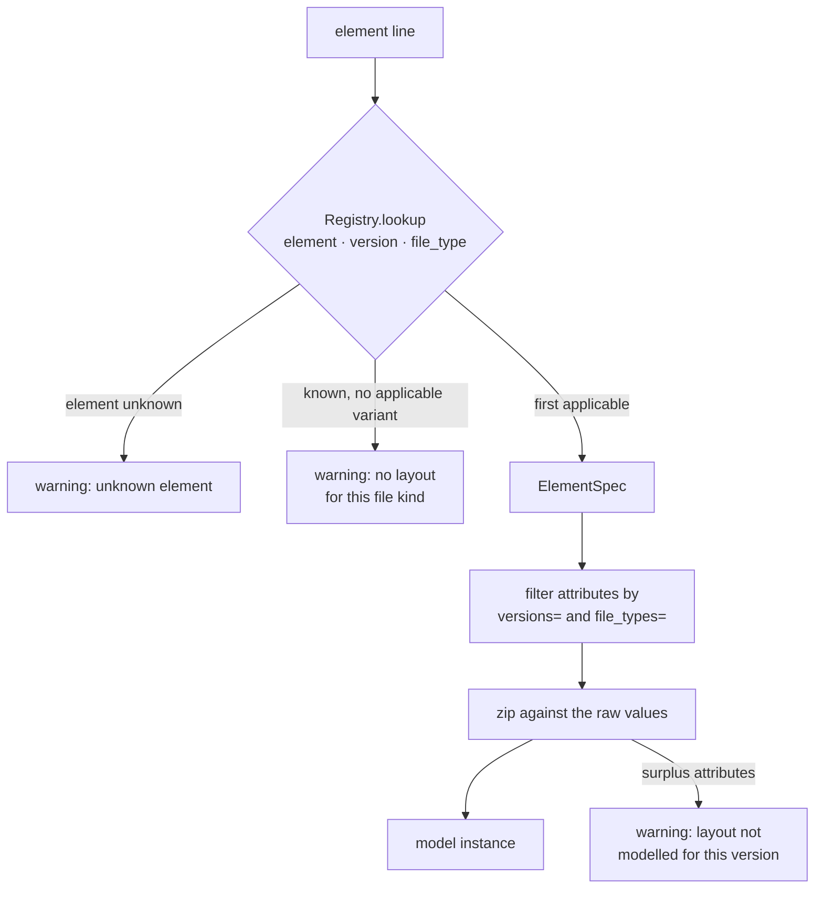
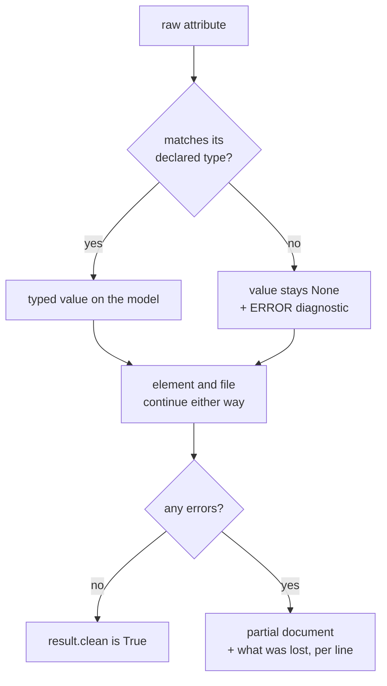

# Architecture

## Pipeline

Reading a file goes through four stages, each in its own module:



| Stage    | Module              | Responsibility                                        |
| -------- | ------------------- | ----------------------------------------------------- |
| Decode   | `core/decoding.py`  | ZIP unwrapping, encoding detection, BOM stripping     |
| Lex      | `core/lexer.py`     | Comments, element/attribute split, line numbers       |
| Bind     | `core/binder.py`    | Positional text to typed model, driven by the table   |
| Assemble | `core/parser.py`    | `FORMAT` first, dispatch, `DATEIENDE`, duplicates     |

Only `core/parser.py` needs the whole file in view, because the `FORMAT` line
decides how every following line is read.

## The element table

The layout of every element is declared in `spec/elements.py` as an
`ElementSpec`: the element name, its attributes in file order, and the conditions
under which each attribute is present.

```python
ElementSpec(
    element="WETTKAMPF",
    target="events",
    model=el.Event,
    attributes=(
        A("number", Kind.INT, "Wettkampfnummer"),
        ...
        A("best_list_category", Kind.ENUM, "Zuordnung Bestenliste",
          enum=BestListCategory, file_types=WITH_BEST_LIST),
        A("qualification_event_number", Kind.INT, "Qualifikationswettkampf"),
        A("qualification_round", Kind.ENUM, "Qualifikationswettkampfart", enum=Round),
    ),
)
```

The binder filters the attributes by version and list kind, then zips the result
against the raw values. Positional shifts therefore fall out of the declaration.
The `file_types=` above is the whole handling of the case where a Vereinsmeldeliste
omits the best-list attribute and both qualification attributes move one position
forward. A mistake there would not crash; it would file the qualification round
under "best list", which is why it is worth keeping declarative.

Two further consequences:

- Adding an element means adding one table entry, not a case plus a handler plus
  a list on the document.
- `dsv-parser spec` and `GET /spec` render the table itself, so the reference
  documentation is generated from the implementation.

`tests/unit/test_spec.py` asserts the table's invariants: every attribute exists
on its model, every target on the document, every `ENUM` attribute names a
vocabulary, and no vocabulary has duplicate codes.

### Choosing a layout

`Registry.lookup(element, version, file_type)` returns the first declared layout
whose `versions=` and `file_types=` admit the file. Declaration order matters, so
the more specific variant comes first. `STAFFELPERSON` is the only element with
two genuinely different shapes (four attributes in an entry list, twelve in a
result list) and is declared twice.



When the version or list kind is unknown, every attribute is treated as present.
For a file whose header could not be read, that is the reading that loses least.

## Diagnostics

The reader does not raise on file content. Problems become a `Diagnostic` with
`severity`, `line`, `element`, `attribute`, `field` and the offending `value`:

| Severity  | Meaning                                                                    |
| --------- | -------------------------------------------------------------------------- |
| `ERROR`   | Data was lost. The attribute is `None`; the rest of the element survives.   |
| `WARNING` | Recovered: unknown element, non-UTF-8 encoding, missing `DATEIENDE`, and so on. |



One warning is worth watching: attributes beyond the declared layout. That is
what an unmodelled format version looks like from inside the parser.

`parse_file` does raise `OSError`. An unreadable file is the caller's problem, a
malformed one is the parser's.

## Decisions

**Swim times are integer milliseconds.** Consumers compare, sum and store them,
and an integer needs no serialisation convention in JSON, SQL or any client
language. `00:00:00,00` is the format's placeholder for "no time" and maps to
`None`, which keeps "did not swim" distinct from "swam in zero".

**Enums carry a speaking value and a file code.** `Stroke.FREESTYLE` serialises as
`"freestyle"`, not `"F"`. The JSON leaves this service for consumers who do not
have the DSV code tables.

**One document type for all four list kinds.** A definition list has events and
fees and no results, a meet protocol the other way round. With one container,
consumers generate a client once and an empty block is data rather than a
different type.

**Every field is optional.** The attribute count of an element depends on version
and list kind, optional attributes are routinely blank, and the reader is
tolerant. Callers that need guarantees should validate the assembled document.

**The HTTP surface is an optional extra.** A consumer that only imports
`parse_bytes` should not have to install FastAPI and uvicorn.

## Source layout

```text
dsv_parser/
├── __init__.py          public API: parse_bytes / parse_text / parse_file
├── cli.py               argparse CLI: parse, check, spec
├── naming.py            the DSV file-naming convention
├── core/
│   ├── decoding.py      bytes → text (zip, encoding, BOM)
│   ├── lexer.py         text → element lines
│   ├── values.py        Zeit / Datum / Uhrzeit / Betrag and their formatters
│   ├── binder.py        element line + layout → model
│   ├── parser.py        assembly, FORMAT handling, diagnostics wiring
│   └── diagnostics.py   Diagnostic, Severity, collector
├── model/
│   ├── document.py      DsvDocument
│   ├── elements.py      one Pydantic model per element
│   └── enums.py         the coded vocabulary
├── spec/
│   ├── fields.py        Attribute, ElementSpec, Registry, Kind
│   ├── elements.py      the element table
│   └── render.py        table → text / JSON for `spec` and GET /spec
└── api/
    ├── app.py           FastAPI factory
    ├── routes.py        /parse /check /spec /health
    └── schemas.py       request and response envelopes
```
