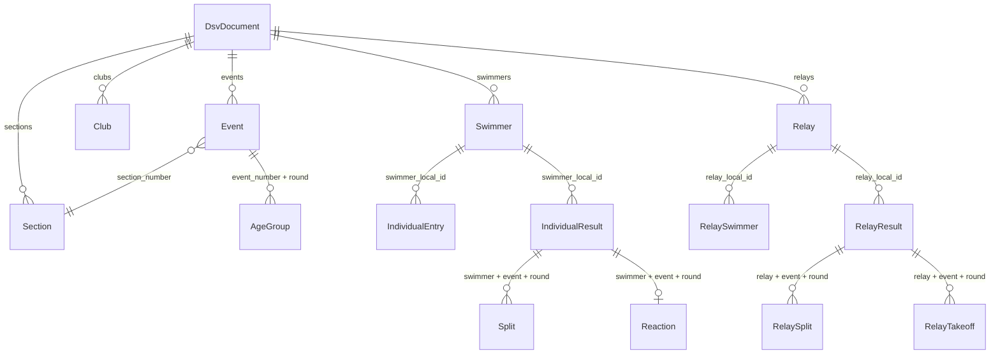

# Data Schema

The parser returns a `DsvDocument`, a Pydantic model defined in
`dsv_parser/model/document.py`. It is the same model the HTTP service publishes in
`/openapi.json`.

## One container for four list kinds

There is one document type, not one per Listart. Which blocks are populated
depends on `file_type`: a definition list has events, age groups and fees but no
results; a meet protocol the other way round. Consumers therefore generate a
client once, and an empty block is data rather than a different type.

`element_counts()` returns the non-empty repeated blocks with their sizes, which
is a cheap way to see what a file actually contained.

```python
>>> document.element_counts()
{'sections': 4, 'events': 62, 'age_groups': 145, 'clubs': 31,
 'individual_results': 1841, 'splits': 3120}
```

## Layout

| Group        | Fields                                                                                                                                        |
| ------------ | --------------------------------------------------------------------------------------------------------------------------------------------- |
| Header       | `file_type` `version` `generator` `meet` `venue` `announcement_url` `organizer_name` `host` `entry_address` `contact_person` `entry_deadline` `bank_account` `direct_debit_only` `remarks` `proof_of_time` |
| Programme    | `sections` `events` `age_groups` `qualification_times` `entry_fees`                                                                            |
| Participants | `clubs` `coaches` `swimmers` `handicaps` `judge_nominations` `judge_section_wishes` `judge_assignments`                                        |
| Entries      | `individual_entries` `relays` `relay_entries` `relay_swimmers`                                                                                 |
| Results      | `individual_results` `splits` `reactions` `relay_results` `relay_splits` `relay_takeoffs`                                                      |

Every list preserves file order. For `events` that order is the meet programme and
carries meaning; for the rest it is whatever the writing software chose.

Element models live in `dsv_parser/model/elements.py`, one per DSV element, with
the field order matching the attribute order of the spec. Each carries
`source_line`, the one-based line it was read from.

## How the parts refer to each other

The document is flat: the lists are not nested, and the links between them are
the numeric ids the format itself uses. Resolving them is the consumer's job.



`local_id` (Veranstaltungs-ID) is unique within one meet and is the key that ties
swimmers and relays to their entries and results. `dsv_id` is the swimmer's
national id and is `0` when unknown. An event is identified by the pair
`event_number` and `round`, since event 12 prelim and event 12 final are two
separate `WETTKAMPF` elements.

## Everything is optional

Every field is `| None`. The reason is the format, not laziness: an element's
attribute count depends on version and list kind, optional attributes are
routinely left blank, and the reader turns a value it cannot represent into `None`
plus a diagnostic. Callers that need guarantees should validate the assembled
document against their own requirements.

## Scalar conventions

| Concept       | Representation                | Note                                              |
| ------------- | ----------------------------- | ------------------------------------------------- |
| Swim time     | `int` milliseconds            | `None` for the `00:00:00,00` placeholder          |
| Reaction time | `int` milliseconds + `negative: bool` | `negative` marks a start before the signal |
| Money         | `int` euro cents              |                                                    |
| Date          | `datetime.date`               |                                                    |
| Time of day   | `datetime.time`               |                                                    |
| Deadline      | `datetime.datetime`           | `MELDESCHLUSS` merges its date and clock          |
| Flag          | `bool \| None`                | `None` means the attribute was absent, not `N`    |
| `JGAK` bounds | `str`                         | `"2010"`, `"AK"`, `"80+"`, deliberately unparsed  |

Milliseconds are always a multiple of ten, since the format's resolution is a
hundredth of a second.

## Coded values

Vocabulary members serialise as speaking strings, not as the file codes:

```json
{ "stroke": "freestyle", "round": "timed_final", "status": "disqualified" }
```

Each member also keeps its file code, which is what the reader matches on and what
a writer would emit:

```python
>>> Stroke.FREESTYLE.value, Stroke.FREESTYLE.code
('freestyle', 'F')
>>> Stroke.from_code(' f ')      # case-insensitive, whitespace tolerated
<Stroke.FREESTYLE: 'freestyle'>
```

`GET /spec` and `dsv-parser spec --json` return the full mapping for every
vocabulary.

`ResultStatus.RANKED` is the one member with no code: a regularly ranked swim has
an empty `Grund der Nichtwertung` attribute, which the reader leaves as `None`.

## JSON output

```python
document.model_dump(mode="json")  # full shape, nulls included
document.model_dump(mode="json", exclude_none=True)  # much smaller, variable shape
```

The CLI exposes both as `dsv-parser parse` and `--exclude-none`; the API as
`POST /parse` and `?exclude_none=true`. Generated clients should stay with the
full shape.
