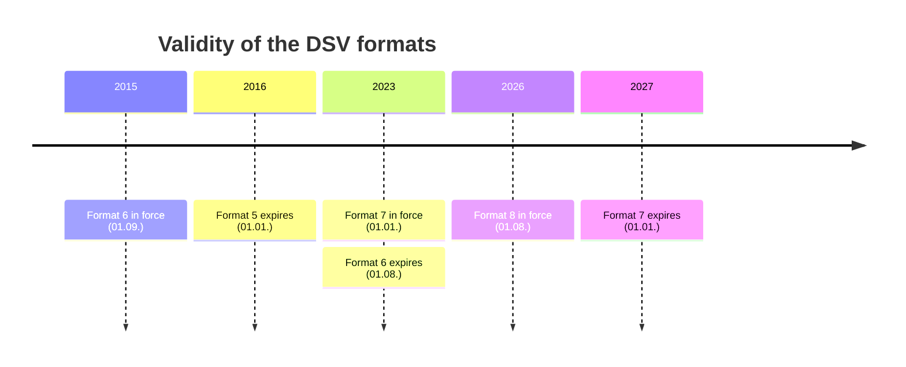
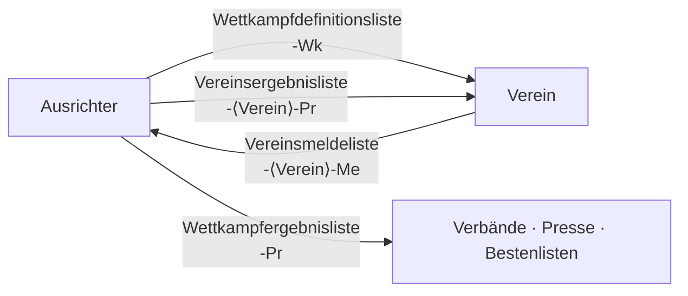

# DSV Format

The DSV-Standard is the interchange format of the Deutscher Schwimm-Verband for
swim-meet entries and results. It is plain UTF-8 text, intended to be readable by
a program and by a person.

## Sources

This parser is transcribed from the official specifications:

| Version | Document date | In force | Notes |
| --- | --- | --- | --- |
| Format 6 | 01.11.2015 | 01.09.2015 – 31.07.2023 | |
| Format 7 | 31.08.2022 | 01.01.2023 – 31.12.2026 | |
| Format 8 | 14.03.2026 | from 01.08.2026 | sole valid format from 01.01.2027 |

The Format 5 document is no longer published; its deltas here are derived from
the Format 6 change log. See [Version deltas](#version-deltas).



## Grammar

```
(* a comment, one line, may appear anywhere *)
FORMAT: Wettkampfergebnisliste;8;
VERANSTALTUNG: 26. Erzgebirgs-Schwimmcup;Marienberg;25;AUTOMATISCH;
WETTKAMPF: 1;E;1;1;100;S;GL;W;SW;;;   (* 100m Schmetterling weiblich *)
DATEIENDE
```

- One element per line: a constant, a colon, then semicolon-separated attributes.
- Attributes are **positional**. An optional attribute that is left out still
  needs its separator, so `A;;C;` has an empty second attribute.
- The trailing semicolon is a **terminator**, not a separator: `A;B;` is two
  attributes, `A;B;;` is three.
- Comments are `(* … *)` and single-line. Real files place them at the end of data
  lines, so a parser that only skips lines beginning with `(*` will leave the
  comment sitting in the last attribute slot.
- Leading and trailing spaces inside an attribute are explicitly allowed.
- `FORMAT` must be the first element, `DATEIENDE` the last.
- `WETTKAMPF` elements should appear in the order the events actually run, which
  is not necessarily ascending by number. The parser preserves that order.

## Data types

| Spec type | Literal | Python |
| --- | --- | --- |
| `ZK` | any text without `;` or newline | `str` |
| `Zahl` | unsigned 32-bit integer | `int` |
| `Zeit` | `HH:MM:SS,hh` | `int` milliseconds — `00:00:00,00` → `None` |
| `Datum` | `TT.MM.JJJJ` | `datetime.date` |
| `Uhrzeit` | `HH:MM`, 24-hour | `datetime.time` |
| `Betrag` | `12,50` | `int` euro cents |
| `JGAK` | year (`2010`), age class (`A`…`J`, `20`, `25`, …) or relay minimum (`80+`) | `str` — deliberately not parsed |

## The four Listarten

| Listart | File suffix | Contents |
| --- | --- | --- |
| Wettkampfdefinitionsliste | `-Wk` | The announcement: venue, sections, events, age groups, qualifying times, fees |
| Vereinsmeldeliste | `-<Verein>-Me` | One club's entries: swimmers, starts, relays, coaches, judges |
| Vereinsergebnisliste | `-<Verein>-Pr` | One club's results |
| Wettkampfergebnisliste | `-Pr` | The full meet protocol, all clubs |

The list kind decides which elements may occur, and for `ABSCHNITT`, `WETTKAMPF`
and `STAFFELPERSON` it also decides the attribute layout.

They form the exchange around one meet: the host publishes the announcement, each
club answers with its entries, and the host returns the protocol.



## File naming

```
JJJJ-MM-TT-Ort-Zusatz.DSV8
```

The date is the **last** section's date; `Ort` is the meet city — not the pool —
truncated to eight characters; club names are truncated to sixteen. Spaces and
hyphens are dropped and umlauts transliterated (ä→ae, ö→oe, ü→ue, ß→ss). Several
files for the same day and city are numbered: `…-Berlin1-Pr.DSV8`.

Implemented in `dsv_parser/naming.py`.

Format 8 adds a ZIP-packed variant, `.DSV8z`, introduced because editors kept
corrupting the encoding of plain files. The archive holds exactly one DSV file of
the same name. The parser detects it by magic bytes rather than by extension.

## Element coverage

All elements of all four list kinds are implemented. `dsv-parser spec` prints the
full table with every attribute, its German spec name, its type and its
applicability; `dsv-parser spec --json` and `GET /spec` give the same as data.

| Group | Elements |
| --- | --- |
| Header | `FORMAT` `ERZEUGER` `VERANSTALTUNG` `VERANSTALTUNGSORT` `AUSSCHREIBUNGIMNETZ` `VERANSTALTER` `AUSRICHTER` `MELDEADRESSE` `ANSPRECHPARTNER` `MELDESCHLUSS` `BANKVERBINDUNG` `LASTSCHRIFT` `BESONDERES` `NACHWEIS` |
| Programme | `ABSCHNITT` `WETTKAMPF` `WERTUNG` `PFLICHTZEIT` `MELDEGELD` |
| Participants | `VEREIN` `TRAINER` `PNMELDUNG` `PERSON` `HANDICAP` `KARIMELDUNG` `KARIABSCHNITT` `KAMPFGERICHT` |
| Entries | `STARTPN` `STMELDUNG` `STAFFEL` `STARTST` `STAFFELPERSON` |
| Results | `PERSONENERGEBNIS` `PNERGEBNIS` `PNZWISCHENZEIT` `PNREAKTION` `STAFFELERGEBNIS` `STERGEBNIS` `STZWISCHENZEIT` `STABLOESE` |
| Terminator | `DATEIENDE` |

## Version deltas

Each of these is a `versions=` marker in `spec/elements.py` or a docstring in
`model/enums.py`.

### Format 7 → 8

Six changes, from the Format 8 change log:

| Change | Effect here |
| --- | --- |
| `BANKVERBINDUNG` gains `Kontoinhaber` | 4th attribute, `versions=V8` |
| `LASTSCHRIFT` — new element, Wettkampfdefinitionsliste | element, `versions=V8` |
| `VEREIN` gains a `Lastschrift` flag | 5th attribute, `versions=V8`, **Vereinsmeldeliste only** |
| `TRAINER` gains `Geschlecht` | 3rd attribute, `versions=V8` |
| `KARIMELDUNG` gains `Geschlecht` | 4th attribute, `versions=V8` |
| `MELDEGELD`: `Teilnehmermeldegeld`, `Abschnittspauschale` | vocabulary |
| `Ausübung`: `KB`/`KR` (Kicks Bauch-/Rückenlage, only with `Technik = S`) | vocabulary |
| Packed `.DSV8z` variant | `core/decoding.py` |

### Format 6 → 7

| Change | Effect here |
| --- | --- |
| `Nationalität 1/2/3` on entries and results | three attributes, `versions=V7_PLUS`, on `PNMELDUNG` `PERSON` `PNERGEBNIS` `STAFFELPERSON` |
| Para classification: `HANDICAP` | element, `versions=V7_PLUS` |
| Vereinfachte Wettkämpfe: best-list `EW` | vocabulary |
| Para best-list `PA` | vocabulary |
| Freiwasser best-list `FS` dropped | vocabulary — kept so Format 6 files still read |
| Gender `D` (divers) | vocabulary |
| Six more judge positions: `STO` `WKH` `ASCH` `SIB` `SAUF` `VER` | vocabulary |

The nationality change is the one that moves attribute positions. It is confirmed
against real files: `PNERGEBNIS` has 16 attributes in a Format 6 protocol and 19
in a Format 7 one.

### Format 5 → 6

Derived from the Format 6 change log, not from the Format 5 document:

| Change | Effect here |
| --- | --- |
| `ABSCHNITT` gains `Relative Angabe` | last attribute, `versions=V6_PLUS` |
| `PNREAKTION` — new element | element, `versions=V6_PLUS` |
| `STABLOESE` — new element | element, `versions=V6_PLUS` |
| `NACHWEIS` — new element | element, `versions=V6_PLUS` |
| Reaction time as `PNZWISCHENZEIT` with `Distanz = 0` removed | **not modelled** — see below |

### The Format 5 caveat

The Format 6 change log is dated after the "Format 6, März 2015" release, so
strictly it records amendments to Format 6 rather than differences against Format
5. A Format 5 file predates all of them in either reading. A Format 6 file written
between March and October 2015 will also lack them, which does no harm: the
missing attribute is the last one of its element, and a missing element is simply
absent.

One Format 5 idiom is not modelled. A reaction time used to be carried as a
`PNZWISCHENZEIT` with distance 0; this parser reads those as splits. Parsing a
Format 5 file emits a warning that says so. See `TODO(spec-v5)` in
`spec/elements.py`.

## Real-world quirks the parser handles

| Quirk | Handling |
| --- | --- |
| Trailing inline comments on data lines | Stripped anywhere, before the split |
| CP1252-encoded Format 5/6 files (spec says UTF-8) | Sniffed; warning on the fallback |
| UTF-8 BOM (spec forbids it) | Stripped |
| Wrong file extension on a ZIP | Detected by magic bytes |
| Spaces inside attributes (`STAFFELPERSON:2525; 4;…`) | Trimmed in the lexer |
| Truncated optional attribute tail | Missing attributes are simply absent |
| Missing `DATEIENDE` | Warning; the document is still returned |
| Content after `DATEIENDE` | Ignored, with a warning |
